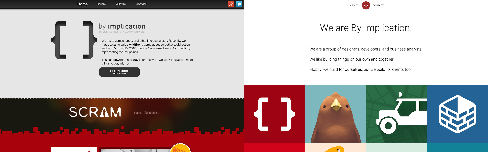

# The By Implication Website
The portfolio and public-facing site of [By Implication](/). (Yes, this link links to this site.)

## Background
Four years overdue, and it's finally here. And yet, this is still something of a temporary website. (But then again, so was the original.) It turns out that while designing for other people can be anywhere from easy to challenging, designing a website for your own firm can be downright impossible. Not because of any lack of skill or talent—there is simply too much investment in the project. As they say, a Doctor that operates on himself has a fool for a patient. But alas, we cannot afford another design agency, and so we must, for the time being, be fools.

## Approach
We had a good set of limitations to work with: the site had to be simple because presumably it would be replaced sometime in the future (But still hold its own in the long run, given our propensity for keeping temporary websites), it had to be search engine indexable (which meant we had to be conscientious about the web technologies we used), and it had to perform all the functions one would expect from a portfolio site.

### Simplicity
Toolbars can be tricky: Because they scale with the width of your medium, at first glance it seems you have a lot of space to work with, when you really don't. It's become standard practice to put anywhere between 4 and 8 items on a toolbar. The consequence for mobile widths, however, is that the designer has to hide some or all of the items behind a menu that a previously invisible button on the toolbar will open. This adds an unacceptable level of complexity to a site.

Our solution was to reduce the number of items on a toolbar, combining the items that make sense to be combined. We ended up with a total of 3 toolbar items: About, Home (represented by our logo) and Contact. This further simplified our site, leaving us to deal with only three major views. The contents of these views will be discussed later.

### Indexability
SEO in the age of single page apps and javascript frameworks is well documented, so we won't discuss that here. We used 